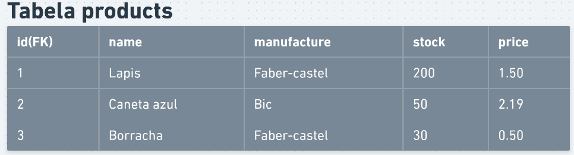
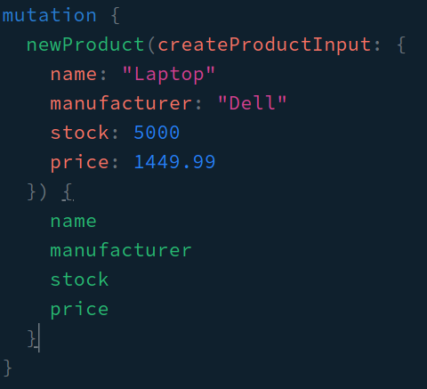
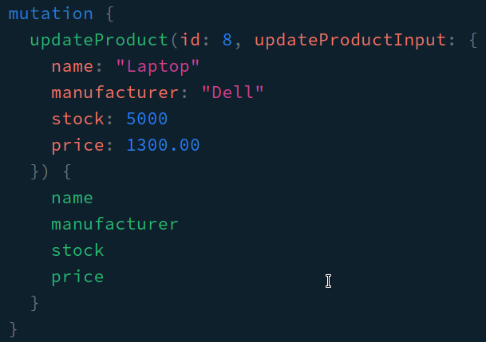
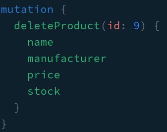

# Desafio backend | Tasken

## Proposta e organização
O desafio consiste em criar um CRUD, para gerenciamento de produtos em um banco de dados.

O primeiro passo é criar uma tabela em um banco de dados relacional, optei por ultilizar SQLite para não haver necessidade de instalação de um banco de dados no sistema, a tabela possui as seguintes colunas:

- **id**: gerado automáticamente ao inserir o produto;
- **name**: nome do produto, sendo a entrada obrigatória de tipo string;
- **manufacture**: fabricante do produto, sendo a entrada obrigatória de tipo string;
- **stock**: quantidade de estoque do produto em questão, sendo a entrada obrigatória do tipo inteiro;
- **price**: preço do produto em questão, sendo a entrada obrigatória do tipo float;

Uma imagem ilustrativa para demonstrar como está organizada a tabela:



**OBS**: a tabela é criada a partir do momento em que a build é feita, logo, o banco de dados estará vazio no inicio da aplicação.

O segundo passo é, a partir da tabela criada, desenvolver um CRUD. 

Foram ultilizados as seguintes ferramentas:

- [x] Typescript;
- [x] NestJS;
- [x] TypeORM;
- [x] GraphQL;


## Como posso testar aplicação?

- Primeiro, clone o repositório aqui do git, utilizado o link fornecido no botão `code`;
- Após clonado, entre na pasta raiz e siga os próximos passos:

### **Iniciando a aplicação com node:**

1. Execute o seguinte comando e aguarde terminar a instalação:

```
$ npm install
```

2. Após finalizado a instalação, execute este comando para criar a build:

```
$ npm run build
```

3. Após finalizado a build, execute este ultimo comando para ter acesso a aplicação:

```
$ npm run start:prod
```

4. Agora, só acessar o seguinte link:
```
localhost:4444/graphql
```

### **Usando a aplicação com GraphQL:**

Ao total, foram desenvolvidas 6 queries e 3 mutations, elas são:

#### **Queries**

- **products**: retorna todos os produtos já salvo no banco de dados;
- **productsById**: retorna o produto que possui o id inserido;
- **getRegisteredProducts**: retorna quantos produtos estão cadastrados no banco de dados;
- **productWithSmallerStock**: retorna o produto com a menor quantidade de estoque;
- **productWithBiggestStock**: retorna o produto com a maior quantidade de estoque;
- **prooductsWithLowStock**: retorna os produtos que possuem uma quantidade de estoque menor que 5;

#### **Mutations**

- **newProduct**: retorna o produto que foi criado, precisando receber os seguites valores:
  - **name**: valor de entrada obrigatória, sendo do tipo string;
  - **manufacture**: valor de entrada obrigatória, sendo do tipo string;
  - **price**: valor de entrada obrigatória, sendo do tipo int;
  - **stock**: valor de entrada obrigatória, sendo do tipo float;
  
    

- **updateProduct**: retorna o produto que foi alterado, precisando receber como primeiro parametro o id, e depois, os seguites valores:
  - **name**: valor de entrada obrigatória, sendo do tipo string;
  - **manufacture**: valor de entrada obrigatória, sendo do tipo string;
  - **price**: valor de entrada obrigatória, sendo do tipo int;
  - **stock**: valor de entrada obrigatória, sendo do tipo float;

    
- **deleteProduct**: deleta o produto em questão a partir do id que foi passado no parametro;
  - **id**: parametro obrigatório, sendo do tipo int;
  
    
